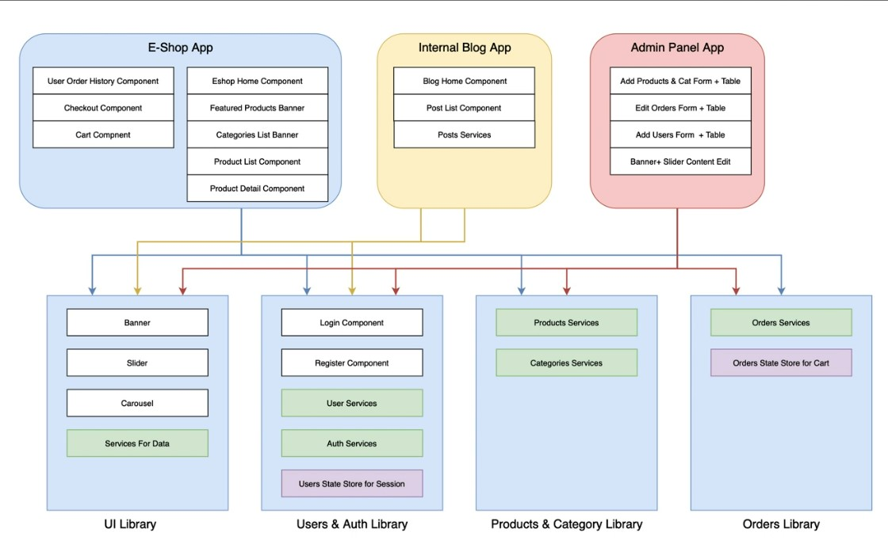
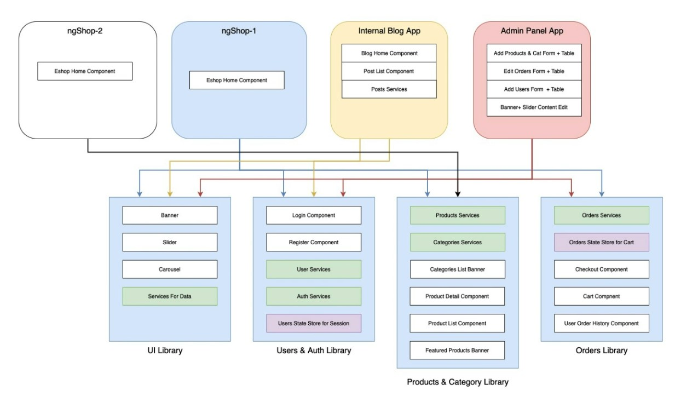

# E-commerce Monorepo

## Our E-commerce System Architecture
<div align="center">
    
</div>

## General Guidelines for NX Navigation
- Create a new workspace:`npx create-nx-workspace@latest`
    - choose integrated monorepo
    - choose angular
- Start an app: `nx serve app-name`
- Start an app in different port: `nx serve admin --port 5000`
- Create another app: `nx generate @nrwl/angular:app admin`
- Create a library: `npx nx g  @nrwl/js:lib ui`
- Using `nx console` for generating components, libraries or modules.
- For style:
    - install bootstrap
    ```javascript
    npm install bootstrap@5.3.0-alpha1
    ```
    - install primeeng:
    ```javascript
        npm install primeng --save
        npm install primeicons --save
    ```
    - install Flex which is another library from primeeng for flex and grid support:
    ```javascript
    npm install primeflex --save
    ```
- Creating a shortcut can be done under `path` in `tsconfig.base.json`:
- For creating `environment` files, 
    - Create a folder in the root directory and add two files; one for production and other for development.
    - Go to `project.json` file and add below lines in `configuration.production`:
    ```javascript
        "fileReplacements": [
        {
            "replace": "apps/ngshop/src/environments/environment.ts",
            "with": "apps/ngshop/src/environments/environment.prod.ts"
        }
        ],
    ```
    - Add a path for environment under `paths` in `tsconfig.base.json`:
    ```javascript
        "@env/*":["environments/*"]
    ```

## Admin App:
- create an admin application using `nx generate @nrwl/angular:app admin` or use NX extensions for generating new application.
- Add pages (dashboard, users, orders, products, categories).
- Add Shared components for sidebar.
- Add products, categories, orders and users lists and forms for new data entries.
- Use libraries for api services.

## Authentication
- Add `user-router` in the `lib/user`.
- Import `UsersModule` library to `AdminModule`.
- Create `login && signup` routers in the `userModule` lib/user.
- Add `AuthGuard` to `adminModule` children routers and check if a user is logged in, otherwise send them back to `login` page.
- Add `usersServices` in the `users` library.
    - `uth.service` for authentication (login and logout):
        - `login ()` is used in the `loginComponent` in the `lib/user`.
        - `logout ()` is used in the `AdminApp/shared/sidebarComponent`.
    - `auth-guard.service` is used in the `admin-router` for securing admin routes.
    - `jwt.interceptor.service` is used for intercepting requesting admin routes. and add it to `providers` array in the `adminModule.ts`


## Shop Application:
As Google uses one login authentication for all their libraries and services. We will be doing the same approach here in our application. We are going to push all the home page logics for different customers/business to library and then leverage these libraries for different customers. This architecture solves the repetition issue, we don't need to write the same code again and again for different customers/business.


<div align="center">
    
</div>